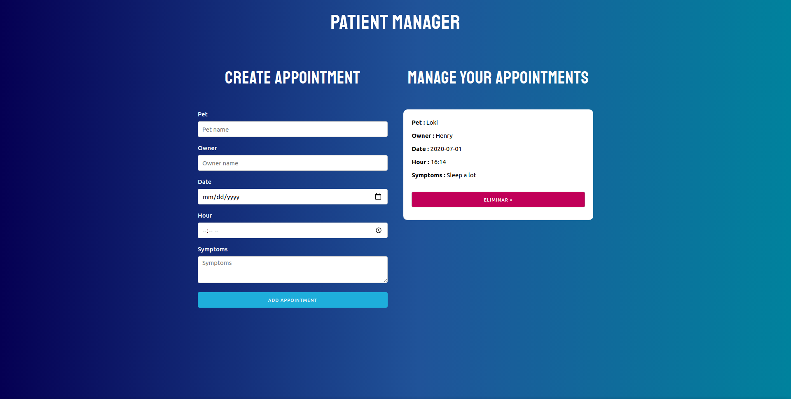

# Veterinary appointments

## Installation of dependencies

```bash or fish
npm install
```

## Usage

```bash or fish
npm run start
npm run build
```

## Captures



## Live demo

here you can try the [app]
 [app]: https://agitated-jones-e722c0.netlify.app/
